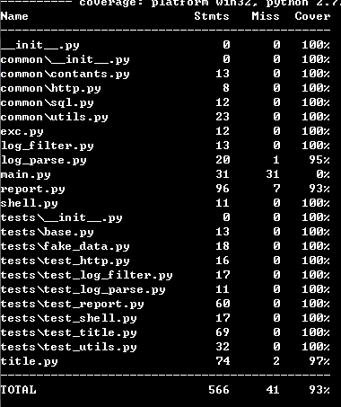

# 操作手册

# 一、命令行使用
1、Linux环境导入analyze-log文件夹

2、命令行工具安装：

    python setup.py install

3、命令行使用

    analyze-log --file-path --report-type [--filter-types] [--ip] [--func]

	--file-path: 日志文件路径（单个日志）
	--report-type: 报表类型，目前只支持三种：
			'article-report'：文章报表
			'ip-report'：IP报表
			'complete-report'： 完整报表
	--filter-types: （可选），滤除的日志类型，默认滤除css和js
	--ip：（可选），http请求需要访问的IP
	--func:（可选），执行功能，默认报表功能，目前只支持两种：
			'report':输出报表功能
			'title':获取文章标题功能

4、基本使用

①从网页读取标题
例如使用analyze-log --file-path apache.log --func title --ip 200.200.1.35获取文章标题，并存入数据库中
或者使用python main.py --file-path apache.log --func title --ip 200.200.1.35
②获取报表信息
例如输出文章报表analyze-log --file-path apache.log --ip 200.200.1.35 --report-type article-report
或者python main.py --file-path apache.log --ip 200.200.1.35 --report-type article-report
5、案例

案例1：

    [root@hxc analyze-log]# analyze-log --file-path ./apache.log --report-type article-report --filter-type css js --ip isyk.xyz:8001
|URL|文章标题|访问人次|访问IP数|
|----|-------|-------|--------|
|/coding/miniprj/material.html|今日头条|1|1|
|/designing/tools/image/UML_classes.docx||1|1|

案例2：

	[root@hxc analyze-log]# analyze-log --file-path ./apache.log --report-type ip-report --filter-type css js
|IP|访问次数|访问文章数|
|----|-------|--------|
|177.1.81.42|3|1|
|200.200.76.130|3|1|

案例3：

	[root@hxc analyze-log]# analyze-log --file-path ./apache.log --report-type complete-report --filter-type css js
|IP|URL|访问次数|
|----|----|------|
|200.200.76.130|/coding/style/%E7%BC%96%E7%A0%81%E9%A3%8E%E6%A0%BC.zip|1|
|200.200.76.130|/coding/miniprj/material.html|1|
|200.200.76.130|/coding/gitbook/fonts/fontawesome/fontawesome-webfont.woff2?v=4.6.3|1|
|177.1.81.42|/designing/tools/image/favicon.ico|1|
|177.1.81.42|/designing/tools/image/gitbook/images/favicon.ico|1|
|177.1.81.42|/designing/tools/image/UML_classes.docx|1|

# 二、执行单测

## 1、Linux环境：
	①下载安装requests，mock, markdown_table, pytest, pytest-cov库，可用pip install requests命令安装
	②将analyze-log文件放入Linux目录下
	③进入analyze-log目录
	④执行pytest --cov ./ 命令，将执行单元测试，并生成覆盖率信息

# 三、单测结果

